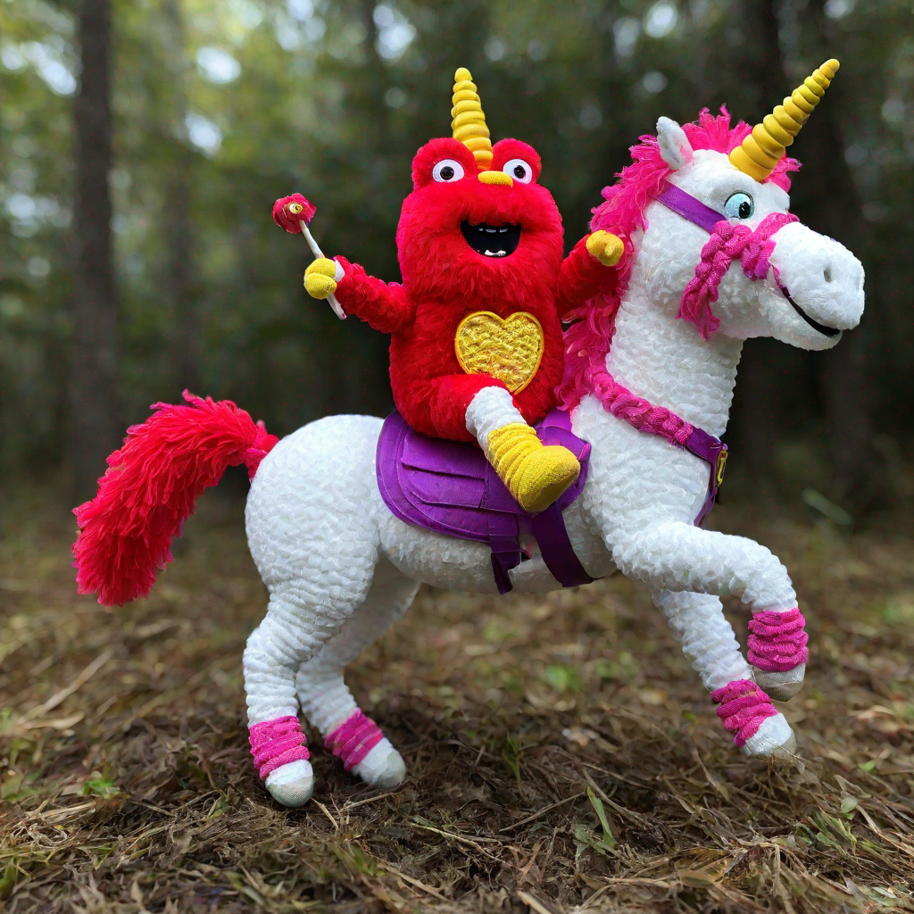
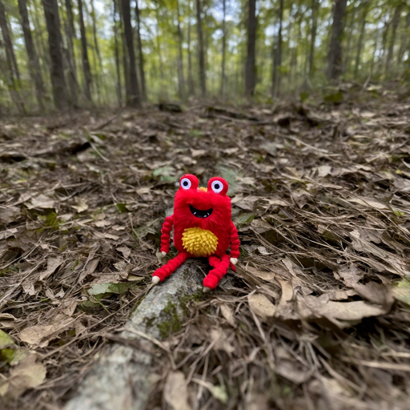
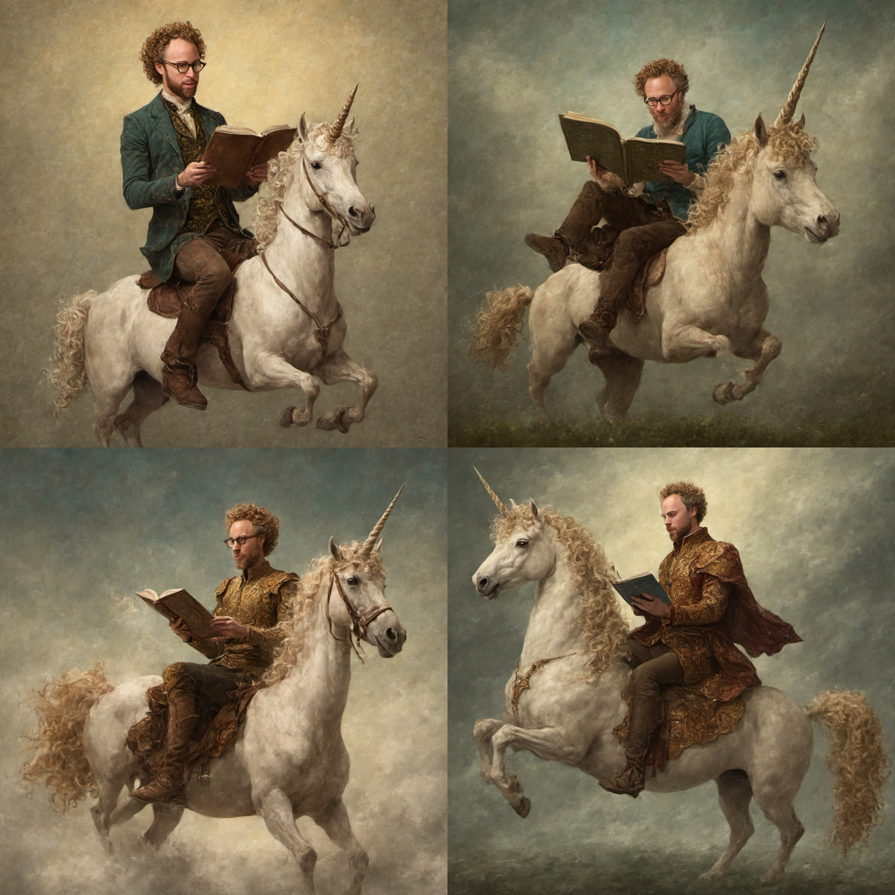
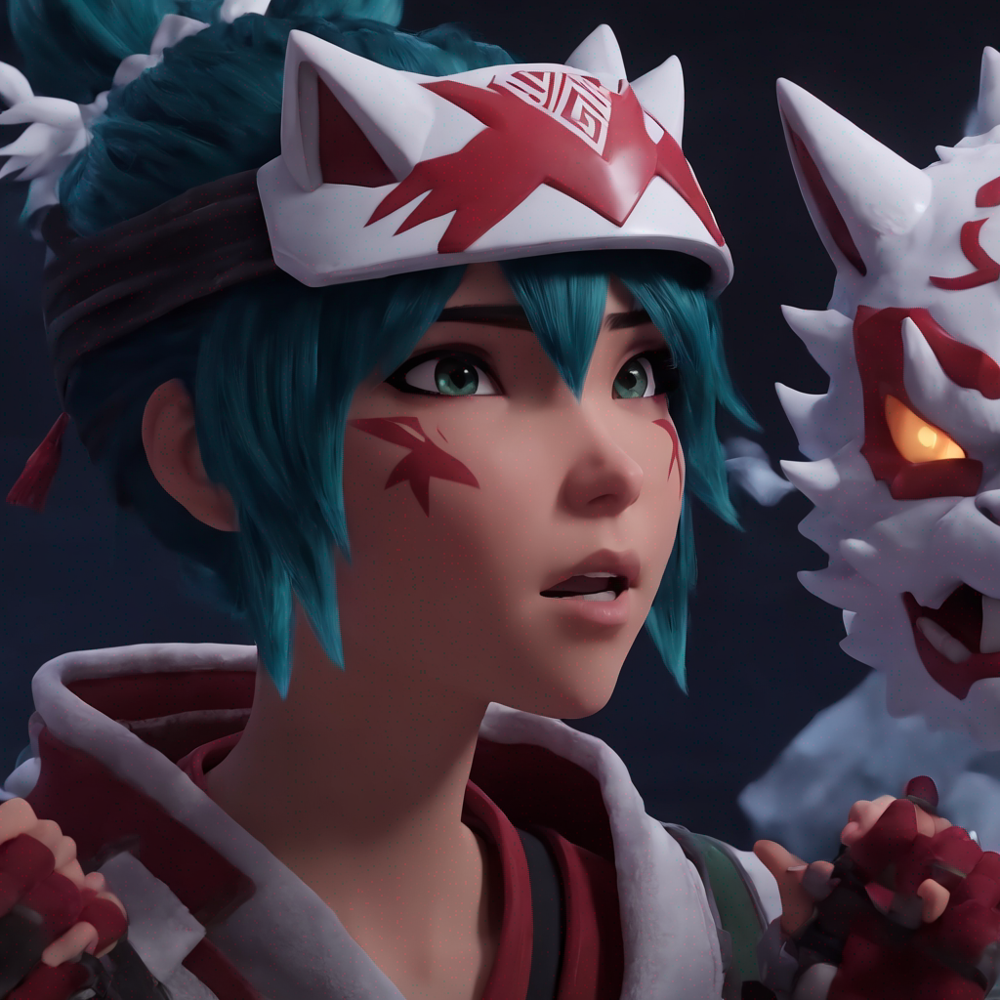

# Fine-tune SDXL 1.0 with replicate api

<!-- #region -->
<p align="center">

</p>
<!-- #endregion -->

- SDXL trainer provides both Dreambooth and textual-inversion capabilities.

- In this post, we will be fine-tuning SDXL 1.0 with replicate api. Every detail will be shared.

Basic Cog usage:

`cog predict -i prompt="a photo of a wild dog"`

`cog train -i input_images=@"example_datasets/zeke.zip"`


# 1. Prepare your Image-Caption dataset

Let's get started! First, we need to prepare an image-caption dataset. For this example, we will be fine-tuning SDXL 1.0 various multi-object images from [Unsplash](https://unsplash.com/) and [Zeke](https://twitter.com/zeke). 

For our API, we need to prepare the dataset in the following format.

#NOTE(jake): If I want to prepare images by hand, what size should I crop to for the best results? 1024x1024?
#NOTE(jake): For the best results, how many images should I use? 10? 100?

1. Actual image files, either in jpg or png format
2. All these files are compressed into a single `.zip` file
3. A generic caption for each of these images with a placeholder token, such as `A photo of TOK`. 

You can check out the example of a fully prepared folder that is usable with the fine-tuning api [here.](contents/coke)

You could also use a zip file that contains images, and no .csv file. If you choose to go this route, you will need to set the `global_caption` parameter when you run your training prediction.

However, to get the best results we recommend using our [SDXL Preprocessor](https://replicate.com/replicate/sdxl_preprocess), which uses [SwinIR](https://arxiv.org/abs/2108.10257) for upscaling, [BLIP](https://arxiv.org/abs/2201.12086) for captioning, and [CLIPSeg](https://arxiv.org/abs/2112.10003) for removing regions of the images that are not interesting or helpful for training. You can check out the code if you are interested [here.](https://github.com/replicate/sdxl_preprocessor)

Before getting started, you'll want to make sure you have setup your API key in the `REPLICATE_API_TOKEN` environment variable. For detailed instructions on how to set this up, please refer to the [replicate python client documentation](https://replicate.com/docs/get-started/python).

```python
import replicate

output = replicate.run(
    "replicate/sdxl_preprocess:bd1158a5052ed46176da900ad7e2a80ea04a3c46196d93f9e1db879fd1ce7f29",
    input={
        "files": open("path/to/file.zip", "rb"),
        "caption_text": "a photo of a MANTOKEN",
        "mask_target_prompts": "a face of a man",
        "target_size": 1024,
        "crop_based_on_salience": True,
        "use_face_detection_instead": False,
        "temp": 1.0,
    },
)

print(output) # Expect to get url to .tar file containing format above, like : https://replicate.delivery/pbxt/xxxx/data.tar

```

Here is a detailed list of possible arguments for the SDXL Preprocessor, and explainations of how to use each of them.

- `files`: zip file containing just images. It can be either jpg, png, or jpeg format.
- `caption_text`: text which will be used for beginning captioning. It can be anything, but we recommend using the name of the person or subject in the image. Note that this can _NOT_ be a token such as `<s0>` or `<s1>`. This will cause later cause unexpected and incorrect behavior with `CLIP-text` encoder. At the moment, we suggest you use something like `"a photo of a man"`.
- `mask_target_prompts` : prompt that describes part of the image that you will find important. For example, if you are fine-tuning your pet, `photo of a dog` will be a good prompt.
- `target_size`: size (width and height) of the image that you want to scale-up to. We recommend this value to be somewhere between 512 to 1024.
- `temp` : how blurry ("strict") you want the mask to be. We recommend this value be something between `0.5` to `1.0`. If you want to have less strict mask, you can increase this value.

#NOTE(jake): What is sailence? Seems worth spelling out what you mean here.

- `crop_based_on_salience` : If you don't provide Square-images, we will automatically center-crop it make it square. If you want to crop the image based on saliency of the image (i.e., where the mask is the most), set this to True. If you want to crop the image based on face detection, set this to False.
- `use_face_detection_instead` : If you want to use face detection instead of CLIPSeg for masking. For fine-tuning face applications, we recommend using this option.

# 2. Fine-tune SDXL 1.0 with replicate API

Now that you have prepared the dataset, let's fine-tune SDXL 1.0 with replicate API.

There are many potential arguments for the fine-tuning SDXL API, here are the important ones:

- `input_data_tar_or_zip`: url to .tar or .zip file containing the dataset. This is the output of SDXL Preprocessor. This can be either url or byte file.
- `unet_learning_rate` : This is the learning rate for UNet. We recommend this value to be somewhere between `1e-6` to `1e-5`.
- `ti_learning_rate_multiplier` : This is the learning rate multiplier for the Transformer. We recommend this value to be somewhere between `10`-`100`.
- `global_caption` : Caption to use for training. This is only relevant if you are not providing csv file with captions. If you set this parameter, this caption will be used for all of your images.

#NOTE(jake): Please make another pass at describing how the token map works. I'm confused 😅. What is the size? is it like an index? Maybe there's a better way to format/illustrate the examples?

- `token_map` : String of token and their impact size specificing tokens used in the dataset. This will be in format of `token1:size1,token2:size2,...`.
  For example, suppose you have dataset of captions with custom token `MYDOGTOKEN` and `MYCATTOKEN`. So, you have a data with caption "a photo of MYDOGTOKEN and MYCATTOKEN". For textual inversion to work properly, you have to tell the trainer that string `MYDOGTOKEN` and `MYCATTOKEN` is actually token. Further, if you want to memorize more of DOG over CAT, you can do this by setting by setting `token_map` to `MYDOGTOKEN:2,MYCATTOKEN:3`. 

### Note: do not use special characters in your token. only use alphabets.
ATOKEN, B_TOKEN_ 

You should certainly play around with all of these parameters to figure out what works best for you. If you figure out an interesting set of parameters, we would love to hear about them! [Join us in Discord](https://discord.gg/replicate) to share your findings, or @ us on twitter [@replicatehq](https://twitter.com/replicatehq).

In our case, we used a total of 2000 steps (200 \* 10 images)

```python
training = replicate.trainings.create(
    version="replicate-internal/sdxl:d46d67520dc4d9853de7b9695e1fedc0cfbdf47af45597899fe471a96894b0df",
    input={
        "input_data_tar_or_zip": open("./mix.zip", "rb"),
        "token_map": "CLOCK_TOK:2,MT_TOK:3",
        "num_train_epochs": 200,
        "unet_learning_rate" : 6e-6,
        "ti_learning_rate_multiplier" : 100,
    },
    #NOTE(jake): If I try to set this to jakedahn/foo, it errors because that model does not already exist. Is there a way we can automagically create the destination model for training runs? kind of annoying to have to do it manually.
    destination="your-username/sdxl_mixes",
)

print(f'ID: {training.id} -- See this training at https://replicate.com/p/{training.id}')
```

# 3.1 Using the fine-tuned model with replicate API

The beauty of `replicate` is that you can fine-tune SDXL with replicate API, and use the fine-tuned model with replicate API as well.

```python
import replicate

output = replicate.run(
    "cloneofsimo/sdxl_mixes:7f11777482fdb949fafc7edab43eb016ff2857970f17d61cd6a3850f7ef34ead",
    input={"prompt": "a photo of MANTOKEN riding a rainbow unicorn"}
)

print(output)
```
_
Great! Now you have a custom SDXL model that is specifically fine-tuned for your needs!
We encourage you to take a look at the detailed fine-tuning code for SDXL 1.0 [here](https://replicate.com/replicate/sdxl_finetune), and to start tweaking it to make your own custom trainer.

# 3.2 For Advanced Users: Using the fine-tuned model with `diffusers` package

Okay, but what if you want to use the replicate fine-tuned model on the HuggingFace API? No worries, you can do that as well! Now is a great time to remind you that all of the code which was used to implement SDXL 1.0 fine-tuning is open-source, so you can have a crystal clear understanding of what is going on under the hood.

First, as you know the training id (TODO: explain how to get training id), you can get the weight directory with `replicate` package.

```python
import replicate

training = replicate.trainings.get("d7nnfkrbdbtsrvtd5tp2ibg7ce")
print(training.output)
# {'version': 'cloneofsimo/sdxl_mixes:7f11777482fdb949fafc7edab43eb016ff2857970f17d61cd6a3850f7ef34ead',
# 'weights': 'https://pbxt.replicate.delivery/rm9uXYAd414eECGelwDAy6jdaNjFetR1V1aBY9eSv6KalrQFB/trained_model.tar'}
```

Untar, and load the model with `diffusers` package.

```python
import torch
from diffusers import DiffusionPipeline

from safetensors import safe_open
from dataset_and_utils import TokenEmbeddingsHandler
from diffusers.models import AutoencoderKL


pipe = DiffusionPipeline.from_pretrained(
        "stabilityai/stable-diffusion-xl-base-1.0",
        torch_dtype=torch.float16,
        variant="fp16",
).to("cuda")

tensors = {}
with safe_open("training_out/unet.safetensors", framework="pt", device="cuda") as f:
    for key in f.keys():
       tensors[key] = f.get_tensor(key)

pipe.unet.load_state_dict(tensors, strict=False) # should take < 2 seconds

text_encoders = [pipe.text_encoder, pipe.text_encoder_2]
tokenizers = [pipe.tokenizer, pipe.tokenizer_2]

embhandler = TokenEmbeddingsHandler(text_encoders, tokenizers)
embhandler.load_embeddings("training_out/embeddings.pti")
```

Now, prompt the model according to the `special_params.json`.

```python
pipe(prompt="A photo of <s2><s3><s4>").images[0].save("monster.png")
```

<!-- #region -->
<p align="center">

</p>
<!-- #endregion -->

# 4. Showoff: Dreambooth results

With the SDXL Fine-tuning API, you can make your own dreambooth models.

It works with humans and now provides exceptional results with SDXL 1.0.

<!-- #region -->
<p align="center">

</p>
<!-- #endregion -->

It works with game characters!

<!-- #region -->
<p align="center">

</p>
<!-- #endregion -->


Now, SDXL 1.0 is only a few days old, and we haven't quite figured out the most ideal parameters to use for everything. So we highly encourage experimentation, and would love to hear about your findings!

[Join us in Discord](https://discord.gg/replicate) to share your findings, or @ us on twitter [@replicatehq](https://twitter.com/replicatehq).
